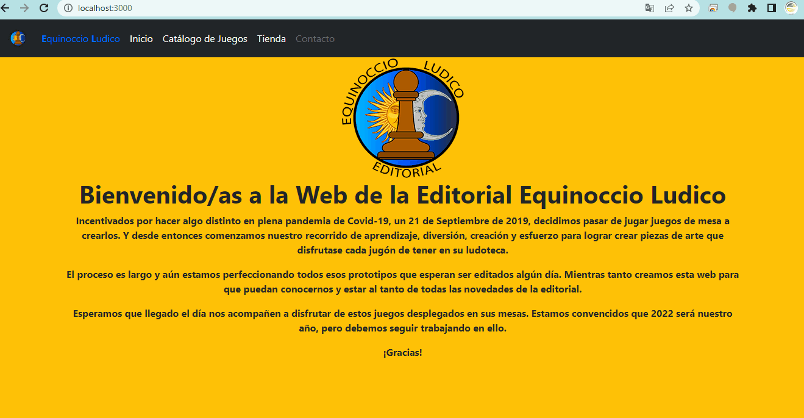
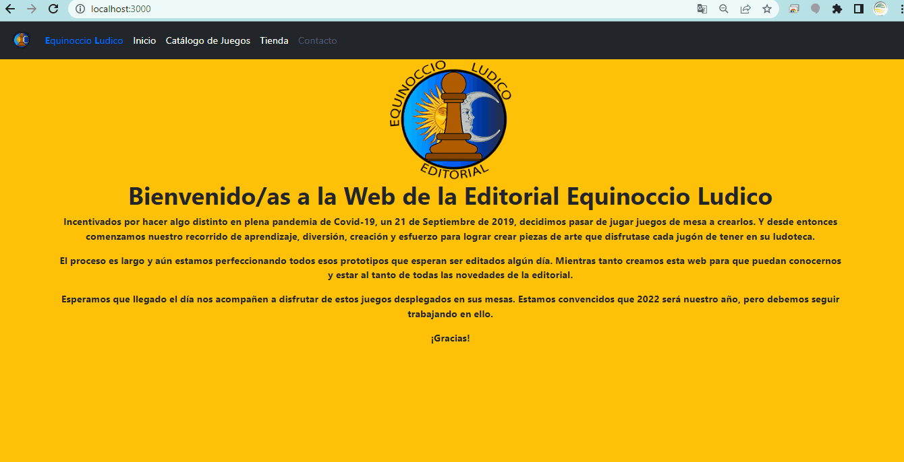
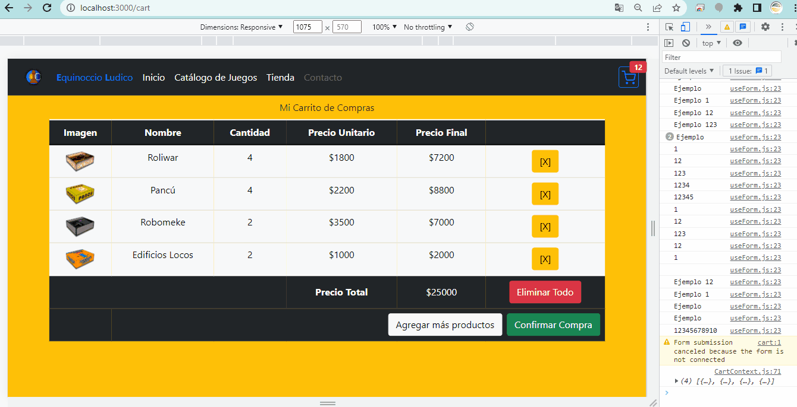
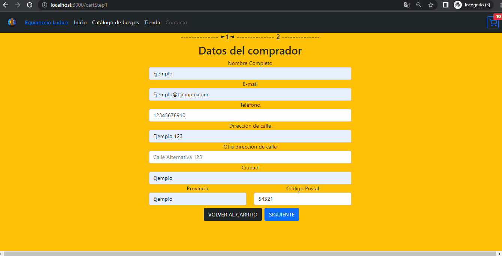

# EDITORIAL EQUINOCCIO LUDICO

Este proyecto forma parte del curso de ReactJS de CoderHouse (Comisión 38240) como entrega final del mismo. Tiene como objetivo lograr crear una aplicación apta para publicar en el portfolio personal de cada alumno.
El proyecto consiste en una aplicación web que contiene un e-commerce para juegos de mesa creados por la editorial que le da nombre al mismo. 

## Alumno
**Nombre:** Joaquín Manuel Carré

**Cursos Realizados:** Desarrollo Web, Programación Web (Javascript) y ReactJS (actual)

## Scripts Disponibles

Para iniciar la aplicación se debe ejecutar desde la terminal el comando:

### `npm start`

Esta aplicación se iniciará en la siguiente dirección:
[http://localhost:3000](http://localhost:3000)

## Versión 0.9
**`Aclaración:`** Esta aplicación está aún en proceso de desarrollo y por el momento no se recomienda recargar la misma (F5) ya que podría generar errores en el proceso de compra.

### Navegación por la aplicación
Para la navegación principal se tiene una barra de navegación con los items disponibles de **INICIO**, **CATÁLOGO DE JUEGOS** y **TIENDA** y un cuarto item aún en fase de desarrollo que es el de **CONTACTO**.

1.**INICIO Y CATÁLOGO DE JUEGOS**

En el primer componente se muestra una breve introducción de la editorial, mientras que en el segundo una breve descripción de los juegos editados.

1.**TIENDA**

Es el componente principal del proyecto en el cual el usuario podrá elegir los distintos productos en venta y agregar al carrito de compras para realizar la compra de los mismos.
Además, podrá filtrar los mismos según su género y añadir cada productos varias veces hasta donde el stock lo permita.

En el carrito de compras podrá eliminar los productos que eligió mal o deshacer todo el carrito de compras, a su vez, si se decide por comprar todo lo seleccionado continuará con el completado de un formulario con sus datos para generar una orden de compra.
Al generar una orden de compra se añadirá un widget con un signo de interrogación como badge (!) donde estarán todos los datos agregados en el formulario de compra y el número de orden de compra.
El usuario tendrá la opción de arrepentirse y cancelar la misma. En el caso que no lo haga no podrá editar su carrito de compras hasta no continuar con la orden generada.
Si el usuario decide proseguir con el pago, una vez que se completen los datos de la tarjeta de crédito/débito, finalizará la compra.

Por otro lado, se trabaja con Firebase, utilizando la base de datos de Firestore para almacenar la orden de compra realizada, o si se cancela la orden se eliminará de esta base de datos. En el caso de finalizar la compra con el pago, la orden quedará guardada.

